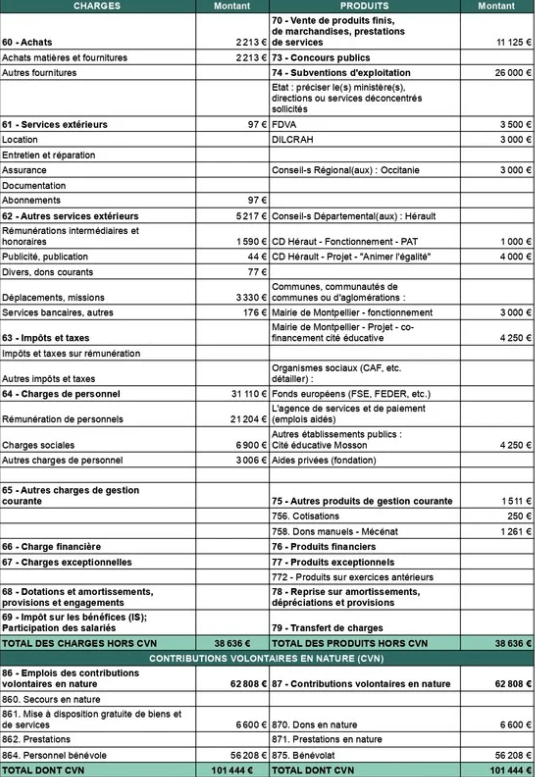

<section class="page-section">
  

    

      

        <h1 class="section-heading text-uppercase">Budget de l'association</h1>
        <h3 class="section-subheading text-muted"><a href="cr2023.pdf" target="_blank">Cliquez ici pour télécharger le compte de résultat de 2023</a></h3>
        <h4 class="section-subheading text-muted"><a href="budget2024.pdf" target="_blank">Cliquez ici pour télécharger le budget de 2024</a></h4>
      

    

  

</section>

  

