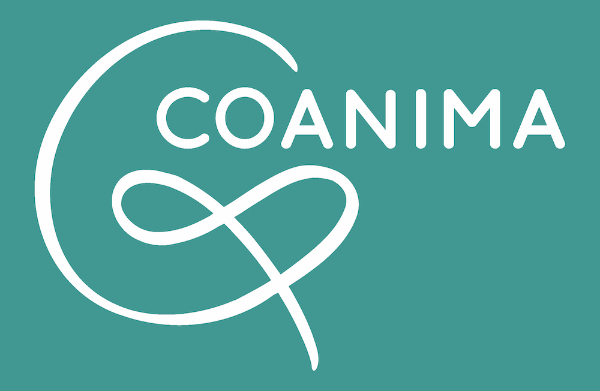
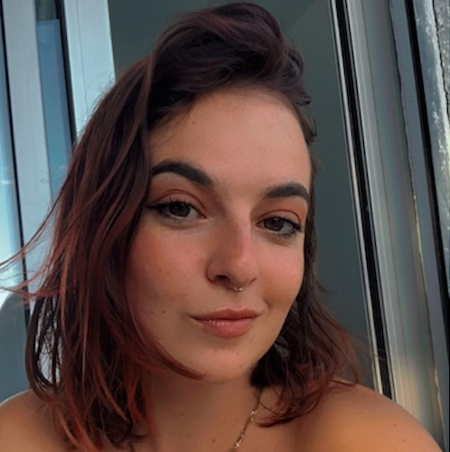
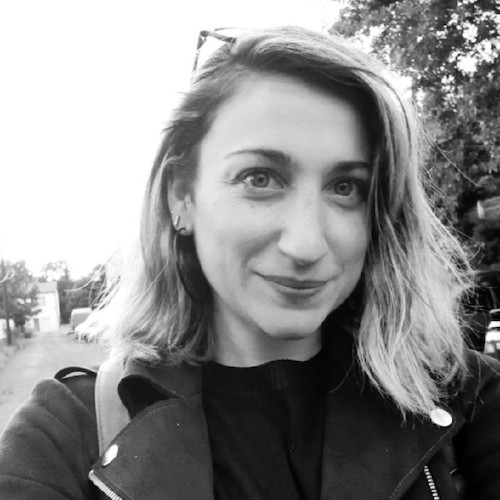
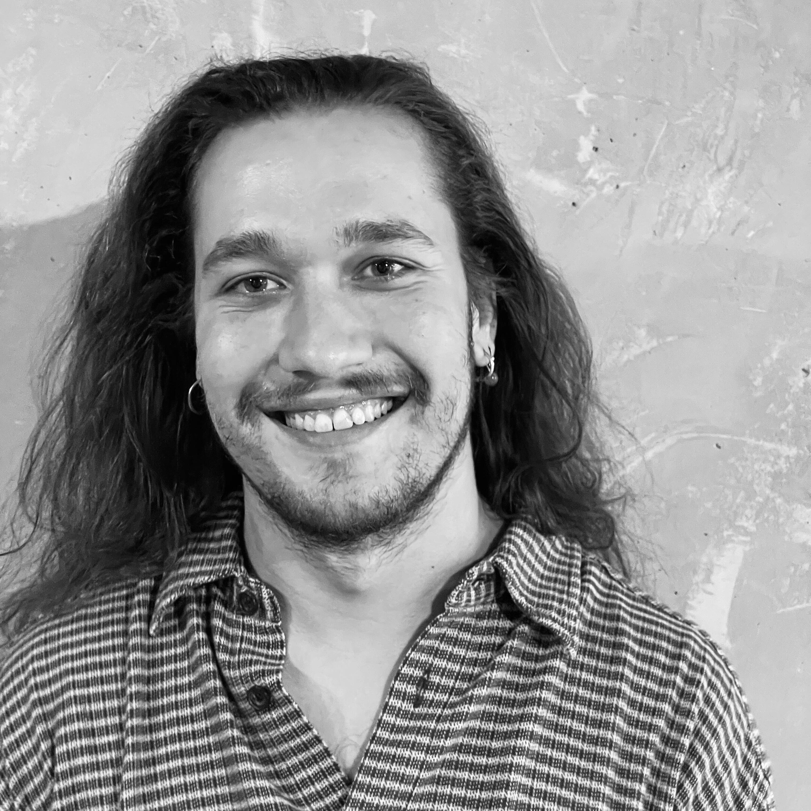

<head>

</head>

<section class="page-section nous-section">
  

    

      

        <h2 class="section-heading text-uppercase"></h2>
      

    

  

</section>



  

    <h2>Nom</h2>
    

      <Strong>COANIMA</Strong> c’est l’animation collective, coopérative et notre mode de fonctionnement collégial, tous ces mots en CO qui parlent de l’expérience commune, du partage, de l’enrichissement par le groupe.
Et pourquoi animation ? de la racine <strong>anima</strong> qui donne la vie. On se fixe pour objectif dans toutes nos animations donner vie aux discussions, aux débats, aux idées, de créer de l’animation dans le cerveau, utiliser notre esprit critique, de bouger aussi et rendre mobile le corps trop souvent oublié dans l’apprentissage.
    

  

  

    
    
Retrouvez nos statuts <a href="/statuts">ici</a>

  

  

    <h2>Logo</h2>
    

      Ce logo représente un grand C, tel les arcs de cercle de chaises qu’on met en place au début de nos interventions. Les lettres o et a suivent, comme les 3 première lettres de COANIMA. Cela fait le son [kwa] -"quoi?"-, toutes ces questions que l'on pose et qu’on nous pose lors de nos ateliers. Ces deux lettres liées font comme une esperluette (&) couchée, logotype cher à notre cœur, représentant l’union, le lien, le fil continu. Dans esperluette, il y a ESPÈRE (l’espoir) et LUETTE (impliquée dans la voix et donc la communication).
    

  

  <!-- Ajoute un saut de ligne -->
  <!-- Ajoute un saut de ligne -->

L'équipe de COANIMA

  <!-- Ajoute un saut de ligne -->

## Louna

  

<!-- Informations de contact de Louna -->

 <!-- Ajout de la marge à droite -->
  <i class="fa-solid fa-phone fa-lg" style="color: #49A695;"></i> +33 7 44 83 83 71  
  <i class="fa-solid fa-envelope fa-lg" style="color: #49A695;"></i> louna@coanima.org

A 17 ans j'accède à mon premier emploi dans l'animation. Ma mission est déjà la lutte contre les discriminations et c'est pour moi une révélation. Cela m'a permis de m'engager concrètement contre les injustices et les inégalités par le biais de l'éducation populaire plutôt qu'en manifestante ou politicienne. L'animation fut pour moi une évidence, et surtout j'adorais ça.
Des années plus tard, comme animatrice réseau, j'ai pris beaucoup de plaisir à transmettre mes connaissances, concevoir de nouveaux ateliers, les expérimenter, créer de nouveaux thèmes et interagir avec des publics variés.
Pour moi, COANIMA est à la fois la réponse et la question : un espace de création, de coopération, d’empathie, que va-t-on bien pouvoir inventer de chouette dans ce joli cadre ?

  <!-- Ajoute un saut de ligne -->

##### 
Mes forces

  

    <i class="fa-solid fa-sun fa-3x" style="color: #49A695;"></i> 
    Énergique
  

  

    <i class="fa-regular fa-copyright fa-3x" style="color: #49A695;"></i> 
    Authenticité
  

  

    <i class="fa-solid fa-lightbulb fa-3x" style="color: #49A695;"></i> 
    Inventive
  

  <!-- Ajoute un saut de ligne -->

###### 
Ce que j’apporte au collectif 

La gestion du site et des données, la comptabilité, les notions agile/lean.

  <!-- Ajoute un saut de ligne -->
  <!-- Ajoute un saut de ligne -->

## Manon

  

<!-- Informations de contact de Louna -->

 <!-- Ajout de la marge à droite -->
  <i class="fa-solid fa-phone fa-lg" style="color: #49A695;"></i> +33 6 77 88 93 35  
  <i class="fa-solid fa-envelope fa-lg" style="color: #49A695;"></i> manon@coanima.org

Amoureuse de l’éducation populaire depuis mon premier emploi dans l’associatif en 2011, je me suis engagée jusqu’alors à la lutte contre les discriminations. En expliquant le mécanisme qui entraîne préjugés et rejet, j’ai trouvé une voie (ma voix), du sens et une mission. Sur ce chemin je me suis enrichie, peut-être encore plus que les publics si divers que j’ai rencontrés. Aujourd’hui j’aspire à aller plus en profondeur dans la compréhension des comportements humains (paix, émotions, besoins, altruisme, écologie…). Je vois dans COANIMA la liberté que j’ai toujours rêvé d’avoir et la confiance en mes collègues pour avancer plus loin, avec plus de folie aussi et de légèreté..

  <!-- Ajoute un saut de ligne -->

##### 
Mes forces

  

    <i class="fa-solid fa-heart-pulse fa-3x" style="color: #49A695;"></i> 
    Sensibilité
  

  

    <i class="fa-regular fa-comments fa-3x" style="color: #49A695;"></i> 
    Communication
  

  

    <i class="fa-brands fa-hotjar fa-3x" style="color: #49A695;"></i> 
    Adaptabilité
  

  <!-- Ajoute un saut de ligne -->

###### 
Ce que j’apporte au collectif:
 

Un réseau partenarial fort, la communication visuelle, la programmation annuelle et la démarche qualité.

  <!-- Ajoute un saut de ligne -->
  <!-- Ajoute un saut de ligne -->

## Audric

  

<!-- Informations de contact de Louna -->

 <!-- Ajout de la marge à droite -->
  <i class="fa-solid fa-phone fa-lg" style="color: #49A695;"></i> +33 7 83 67 72 12  
  <i class="fa-solid fa-envelope fa-lg" style="color: #49A695;"></i> audric@coanima.org

La richesse de mon parcours se base sur la diversité de mes expériences. J’ai traversé différents horizons professionnels et eu différents engagements dans la lutte contre les discriminations. Ma passion éclectique pour les sciences m'a conduit à étudier le Génie Mécanique, la Sociologie et la Philosophie. Nourris de ces expériences, muni de mon DEJEPS DPTR, je m'engage maintenant dans COANIMA, où se marient harmonieusement pédagogie, curiosité et créativité. Cet espace offre une toile idéale pour cultiver des idées neuves et grandir par l’intelligence collective tout en collaborant avec une équipe de confiance avec qui je partage mes valeurs.

  <!-- Ajoute un saut de ligne -->

##### 
Mes forces

  

    <i class="fa-solid fa-users fa-3x" style="color: #49A695;"></i> 
    Sociabilité
  

  

    <i class="fa-brands fa-searchengin fa-3x" style="color: #49A695;"></i> 
    Curiosité
  

  

    <i class="fa-solid fa-head-side-virus fa-3x" style="color: #49A695;"></i> 
    Esprit Critique
  

  <!-- Ajoute un saut de ligne -->

###### 
Ce que j’apporte au collectif
 

Toutes les veilles (scientifiques, pédagogiques, politiques, réglementaires…) et l’écriture des dossiers de subvention.

  <!-- Ajoute un saut de ligne -->
  <!-- Ajoute un saut de ligne -->
