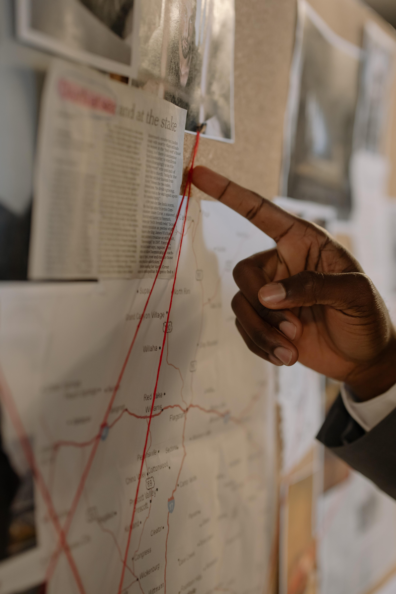

<head>

  
</head>

<body>
  

    
    

      <h1 style="text-align: center;">Enquête  Dysto Pique</h1>
      <h3 class="section-subheading text-muted" style="text-align: center;">En construction</h3>
      

        <i class="fas fa-person-digging large-icon"></i>
        

          
Plongez dans un futur dystopique fondé sur des problématiques contemporaines. Menez l’enquête afin de forger le récit qui a entraîné cet avenir sombre. Aiguisez votre esprit critique dans un univers où émotions, réflexion et créativité s'entremêlent. Ensemble, envisagez des solutions alternatives pour repenser les choix du présent et leurs répercussions. Découvrez ce voyage dans le temps intriguant !

        

      

    

  

</body>

